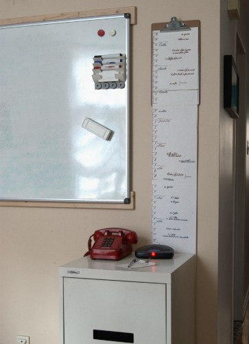

Depuis trois ou quatre ans, j'utilise un calendrier que j'ai designé
et que je fait moi-même. J'ai écris
[un billet en février 2009]()
à ce sujet. Depuis ce temps, j'ai revu et
amélioré mon design. Moins de trous et d'adhésifs endommagent le
mur. L'usage est simplifié en collant les feuilles entre-elles et en
accrochant le tout à une seule vis au mur. Je suis aussi devenu bien
plus habile en photo pour en faire la démonstration.

<h3>Instructions</h3>

1. Prendre quatre feuilles 8½×14" (format légal). Mesurer une marge de ½ pouce en haut et en bas. Il reste 13 pouces. 13&nbsp;× 4&nbsp;= 52 pour les 52 semaines de l'année;
1. Il y a une année de 53 semaines 71 fois par 400 ans ([Wikipedia](http://en.wikipedia.org/wiki/ISO_week_date)).  Ajuster pour ce fait avec une feuille sans marge et 14 semaines;
1. La première semaine de chaque feuille correspond aux solstices et aux équinoxes;
1. Marquer 7 jours dans chaque espace de 1", avec une marque pour séparer les fins-de-semaines;
1. Identifier les mois;
1. Inscrire [ les événements de l'année](http://timeanddate.com/calendar/custom.html?year=2011&country=27&cols=3&hol=889&df=1);
1. Coller les feuilles ensemble avec du ruban adhésif;
1. Insérer la première feuille dans une tablette presse-papier;
1. Attacher une corde autour de la tablette, de sorte à ce qu'elle passe devant le papier et que le noeud soit derrière la tablette;
1. Suspendre le tout à une vis au mur;
1. Ajouter une feuille quatre fois par année, en retirant la plus ancienne.

## Principes du design de mon calendrier

| Calendrier classique | Mon calendrier |
|----------------------|----------------|
| Une page par mois, un calendrier par année. | Frise linéaire continue, une analogie avec le passage du temps. |
| Une petite case pour chaque jour. | Format libre permettant d'écrire sans contrainte. |
| Nécessité de tourner les pages pour consulter les jours à venir. | L'année à venir en un coup d'oeuil. |
| Faire une croix sur les jours passés pour indiquer la date. | Curseur mobile. |
| Habituellement basé sur le modèle américain. | Standard ISO&nbsp;8601; la semaine commence le lundi. |
| Aucune considération pour l'archivage. | Quatre feuilles par année pour l'archivage. |
| Bon marché. | Très bon marché. |

## Photo

Mon calendrier est placé juste à côté de mon tableau blanc. Le
classeur qui est devant est sur roulettes donc il se déplace
facilement. En le plaçant devant le calendrier, il empêche celui-ci
d'être emporté par les courants d'air. Seulement la dernière
feuille du bas est masquée. Si j'avais plus d'espace dans mon bureau,
j'aurais laissé le calendrier découvert et j'aurais utilisé une grosse
pince relieuse attachée au bas pour lester le papier.

        



     
    Alexandre's calendar design by
    <a xmlns:cc="http://creativecommons.org/ns#"
       href="http://alexandre.deverteuil.net/blogue/archives/2011/12/04/le_calendrier_ameliore/index.html"
       property="cc:attributionName"
       rel="cc:attributionURL">
        Alexandre de Verteuil</a> is licensed under a
    <a rel="license"
       href="http://creativecommons.org/licenses/by-nc-sa/3.0/">
        Creative Commons Attribution-NonCommercial-ShareAlike 3.0 Unported License</a>.

