## Introduction

Ça vaut vraiment la peine d'investir du temps, acheter le bon matériel et dédier suffisamment d'espace à la litière à chats. La corvée de vidage de la litière peut être rendue facile tout en respectant les besoins des chats. Je vide la litière 1 fois par semaine, deux chats l'utilisent, et ma blonde, qui a le nez très fin, ne détecte pas d'odeurs. Voici, en détails, mon installation.

## Choix de l'emplacement

Dans notre petit appartement, l'endroit le plus optimal à cette fin est l'espace sous ma table de travail. Je travaille debout, donc il y a de l'espace disponible sous le bureau. J'ai un tapis confortable qui sert également de repose-genoux lorsque je vide la litière.



## Caractéristiques

* Le bac est assez grand &mdash; ça prend un grand bac assez profond pour le confort des chats, accumuler plus de rejets, et éviter les débordements de litière tout autour du bac;
* C'est caché &mdash; le panneau camouflage sert également à créer un couloir d'accès désigné &mdash; points boni pour le motif de camouflage;
* La trajectoire de sortie à 90° force l'animal à ralentir, évite qu'il décolle en sprint lorsqu'il a terminé, répendant de la litière sur le plancher;
* Le tapis du couloir d'accès capture presque tout le sable;
* Les chats peuvent surveiller l'environnement lorsqu'ils font leurs besoins &mdash; il faut qu'assez de lumière pénètre dans leur espace; les chats deviennent anxieux si leur litière est dans un espace clos;
* Une planche à roulettes permet un retrait facile du bac sans abîmer le plancher;
* Des pinces relieuses tiennent le sac pour un transfert facile et sans gâchis de la matière;
* La marque de litière QualiCat ne sent pas et coûte moins cher;
* Les outils sont accesibles à l'intérieur du panneau camouflage.



## Matériel nécessaire

* 1 bac de rangement réutilisé en bac à litière, longueur 55&nbsp;cm × largeur 40&nbsp;cm × hauteur 30&nbsp;cm. Un des côtés a une partie coupée à la scie sauteuse pour faciliter et contrôler l'accès des chats;
* 1 pelle avec des fentes;
* 1 pelle pleine &mdash; pour ramasser les mottons qui se défont;
* 2 pinces relieuses;
* 1 planche et 4 roulettes;
* 1 rouleau de matériel adhérent pour fond de tiroir &mdash; ça va sur la planche à roulettes, sous le bac de litière;
* 1 petit tapis coupé sur mesure;
* 1 panneau camouflage amovible&nbsp;:
    * bois 2×2
    * treillis
    * peinture
    * tissu à motif camouflage
    * colle chaude, colle blanche, taques, clous, vis
    * feutres pour pattes de meubles pour glisser sur le plancher
    * aimant &mdash; pour tenir les pinces relieuses
* Petit balai et porte-poussière;
* Litière QualiCat de chez Costco;
* Bicarbonate de soude;
* Un bon aspirateur, genre Dyson.

## Processus de vidage

1. Voici ce qu'a l'air mon installation.  
   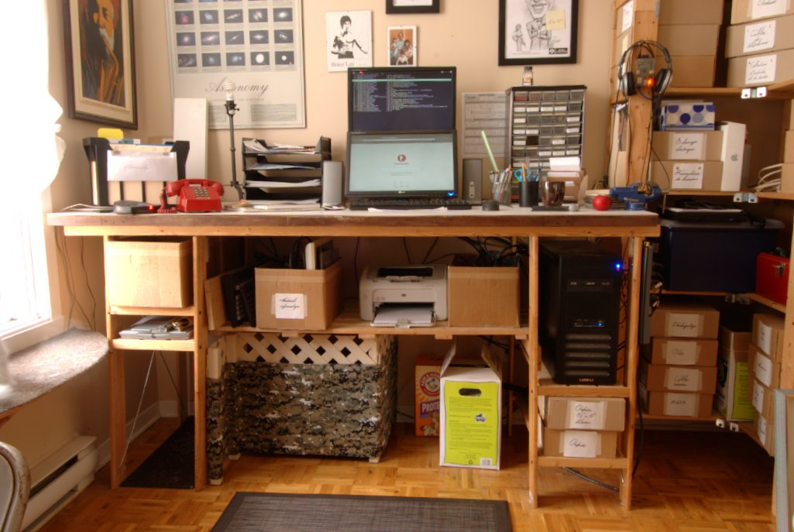
1. Voici le panneau camouflage retiré.  
   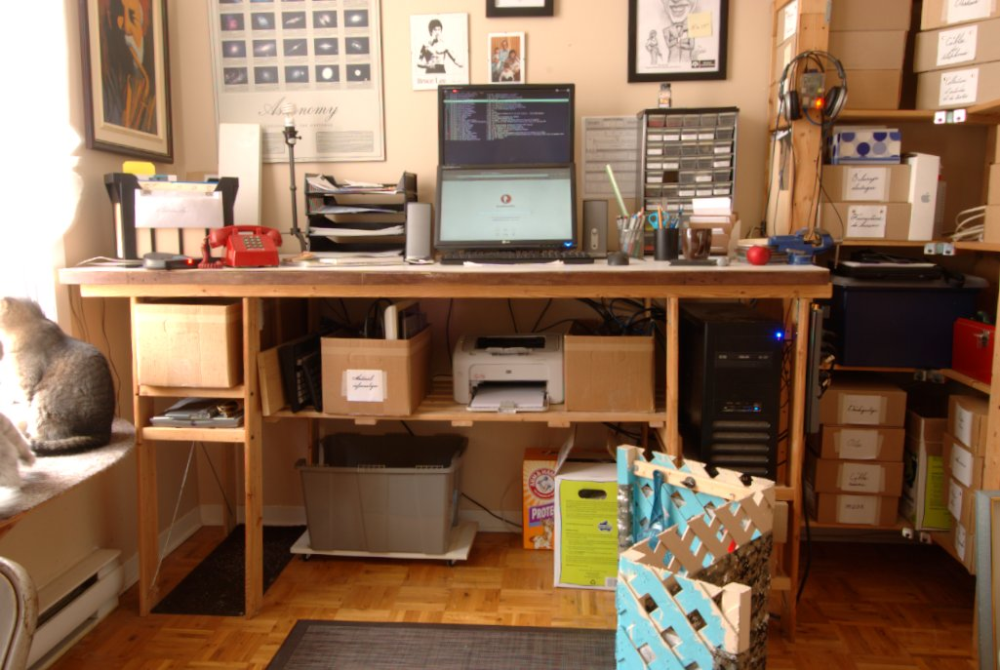
1. Le bac de litière sur planche à roulettes sort facilement pour travailler.  
   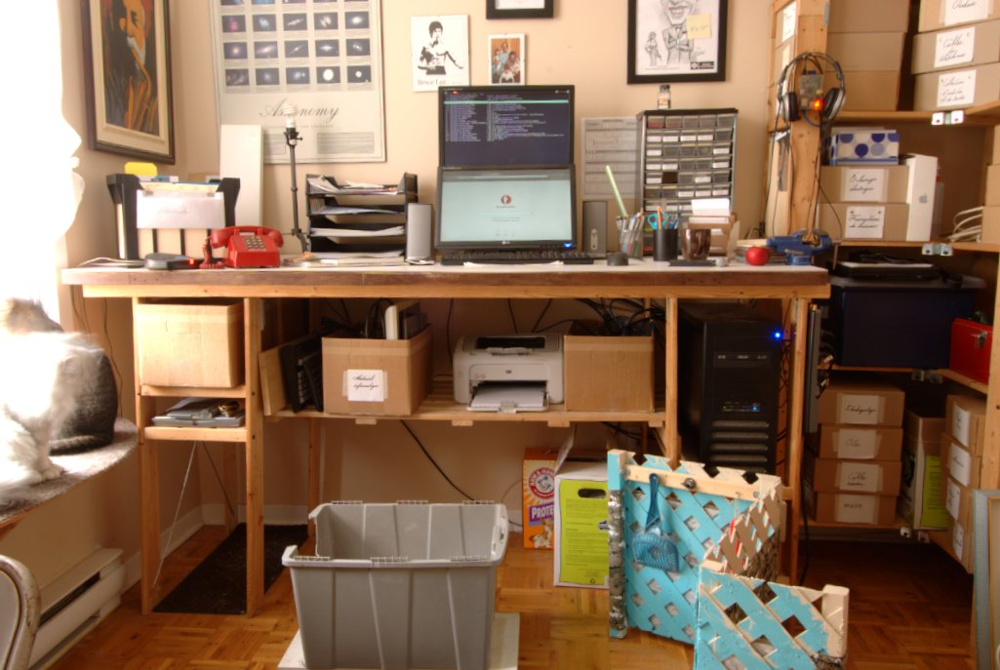
1. Les pelles et les pinces relieuses sont rangées derrière le panneau camouflage avec des vis et un aimant.  
   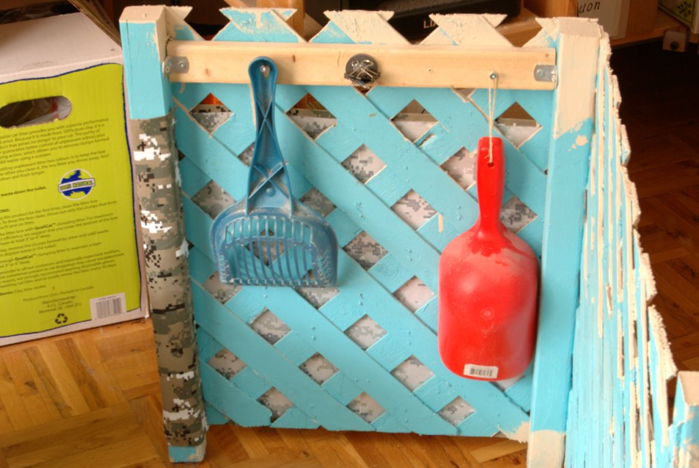
1. Voici un gros plan sur l'aimant qui tient les pinces relieuses en place.  
   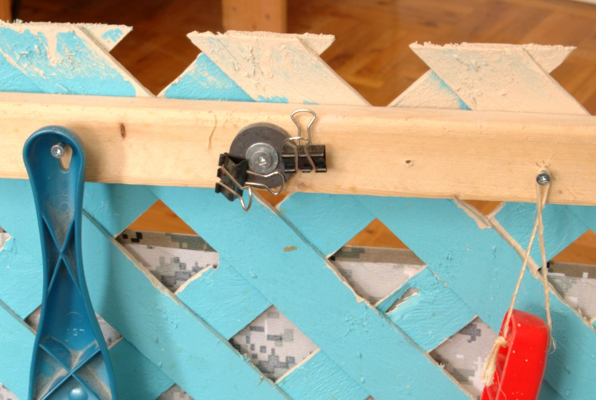
1. Les pinces relieuses servent à tenir le sac de poubelle au rebord du bac de litière de sorte que l'ouverture du sac soit facilement tenu ouvert à une main tandis que l'autre main manipule la pelle.  
   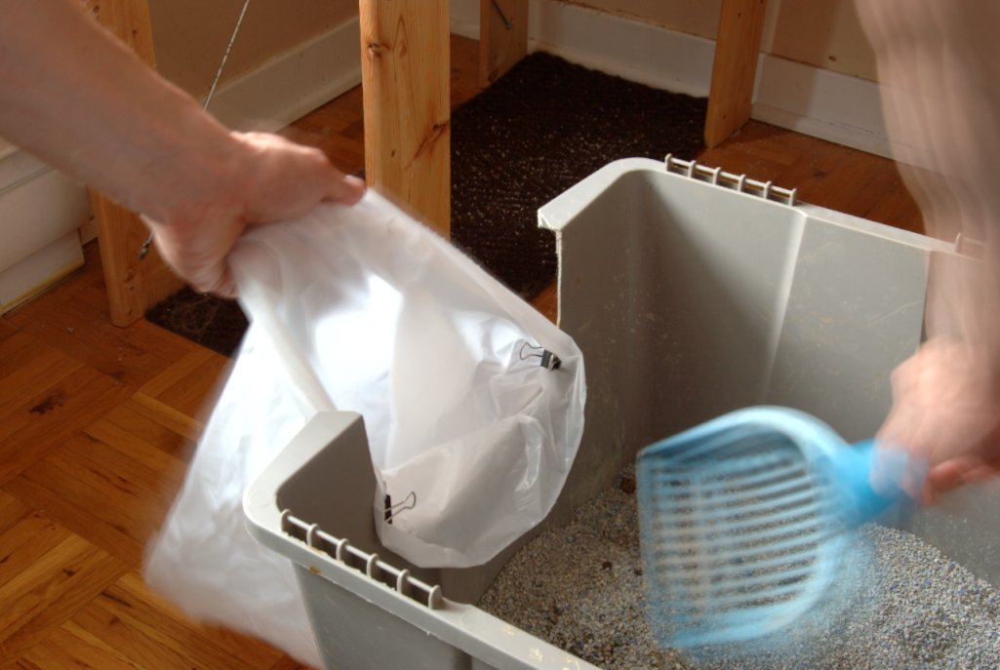
1. Transfert de matière terminé.  
   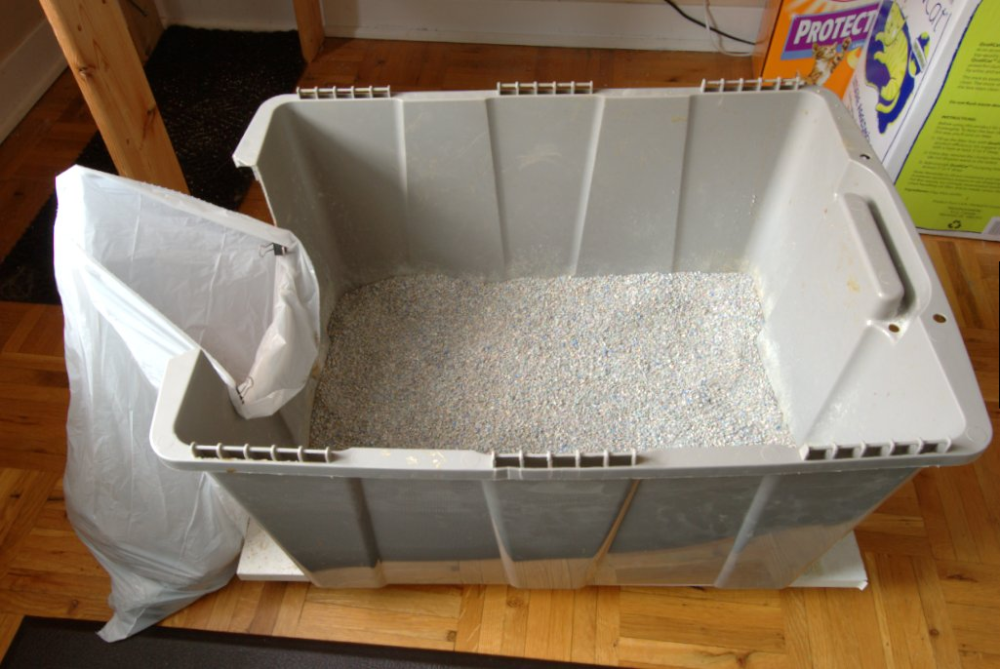
1. Ensuite j'uniformise la surface de la litière restante.  
   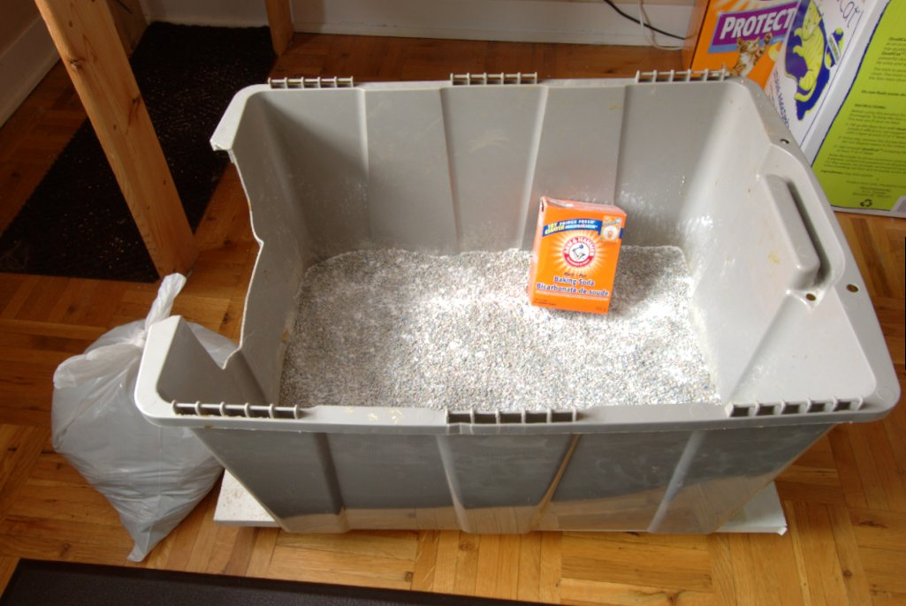
1. Je rajoute une quantité de litière par dessus.  
   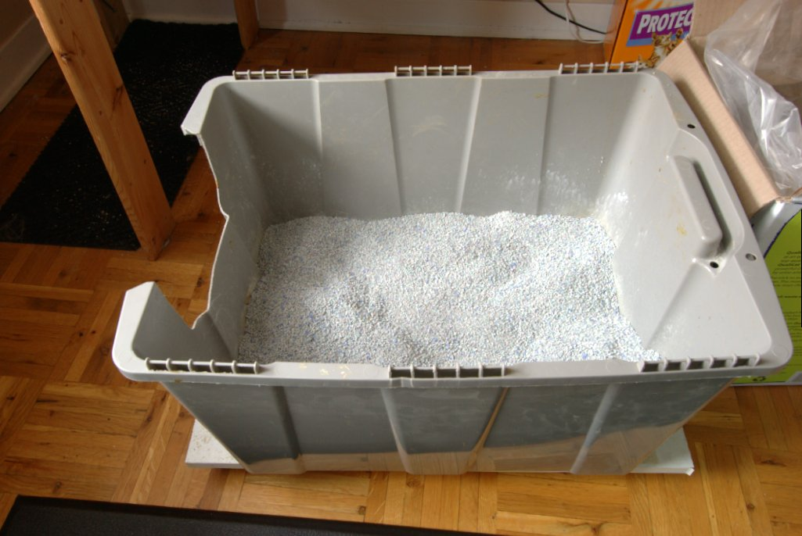
1. Je sors le tapis du couloir d'accès.  
   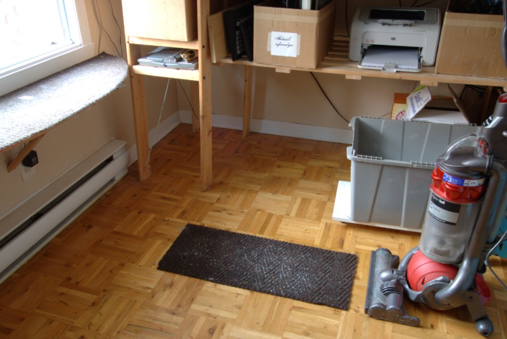
1. Le tapis et le bac sont remis à leur place.  
   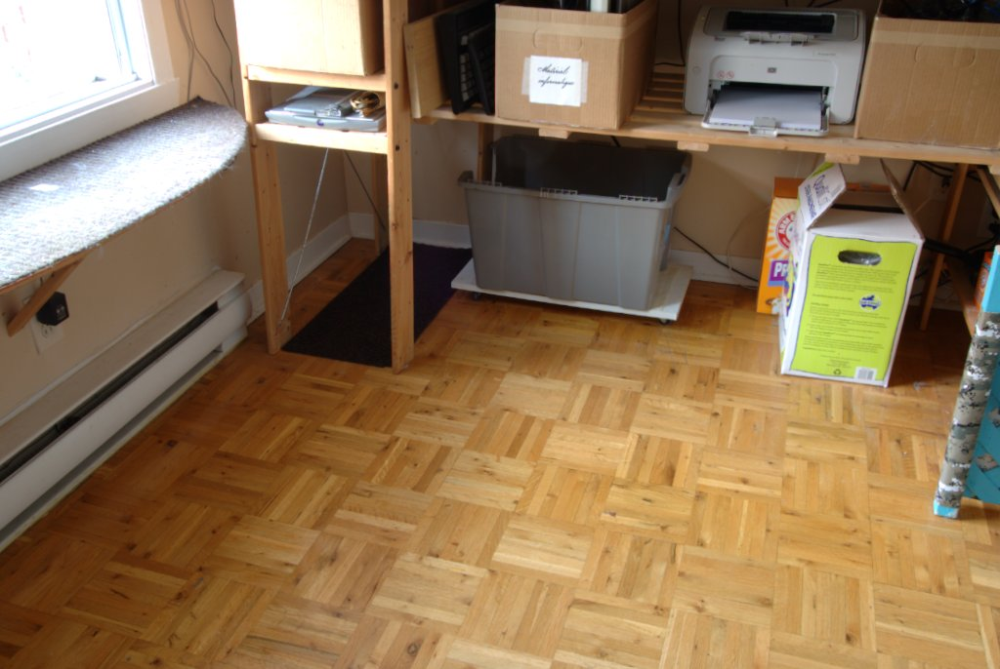
1. On termine en replaçant le panneau camouflage.  
   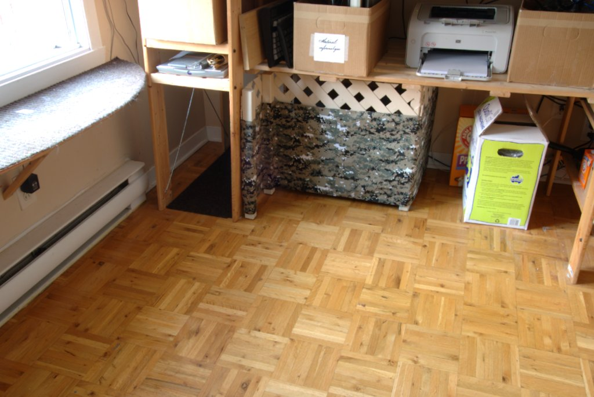
1. Voici la marque de litière que je recommande.  
   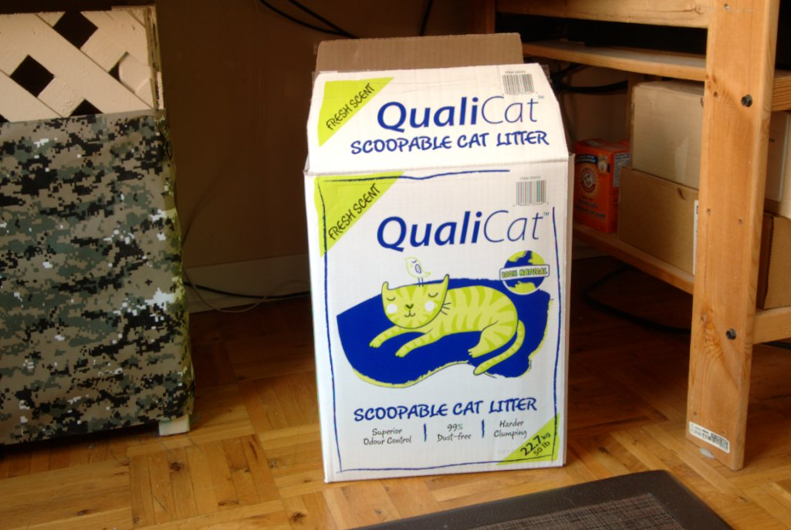

## Finale


