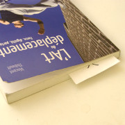

Lorsque je commence la lecture d’un livre, je trouve un bout de papier sur lequel je marque un «&nbsp;X&nbsp;» et je m’en sert comme marque-page.

Il y a trois avantages à cette idée&nbsp;:

1. Selon la façon dont le marque-page est placé en ouvrant le livre, **le X marque le quadrant de page** où la lecture doit reprendre (*cf*&nbsp;l’illustration ici-bas);
2. L’espace blanc sur le marque-page permet de prendre des notes;
3. Il y a une disponibilité illimitée de marque-pages à la portée de la main.


