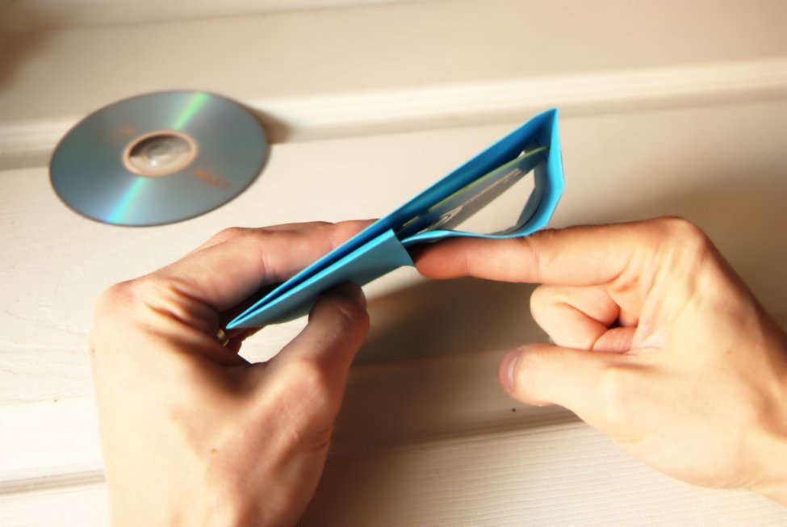
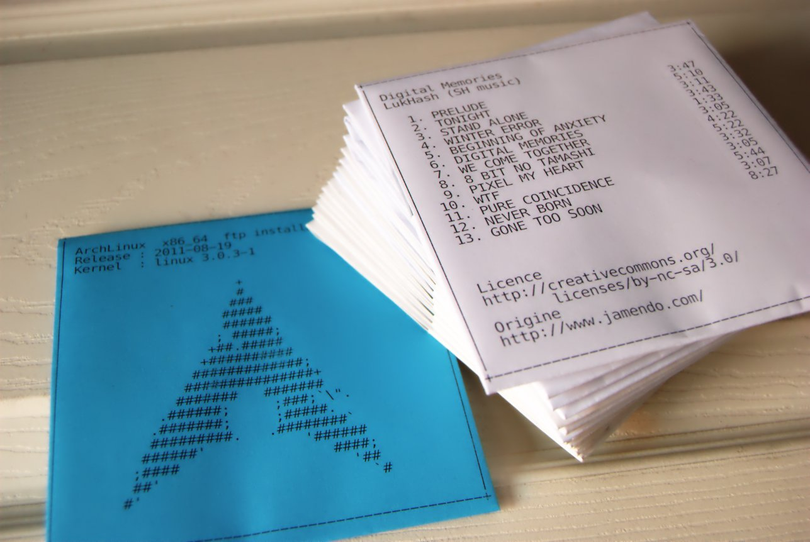

Je dois à <a href="http://lifehacker.com/115252/how-to-make-a-paper-cd-case">
lifehacker</a> et à <a href="http://www.papercdcase.com/">papercdcase.com</a>
des remerciements pour m'avoir permis d'apprendre cette
technique. Je design mes pochettes au crayon, avec
<a href="http://inkscape.org/?lang=fr&amp;css=css/base.css">Inkscape</a>,
ou récemment en ascii, ce qui me permet de scripter le processus. J'ai un
script qui source les données d'une playlist dans
<a href="http://cmus.sourceforge.net/">cmus</a> (mon lecteur de musique),
qui grave le CD audio et produit la pochette avec la playlist,
automatiquement. Ce script fera l'objet d'un prochain article mais vous pouvez
voir à la dernière photo ce que ça donne.

1. Pour commencer, j'utilise un DVD égratigné comme gabarit, c'est le même depuis
   des années. Pour la démonstration, j'utilise du papier bleu, pour améliorer
   la visibilité. Mon bureau, c'est une porte.  
   
2. Trouvez le centre du bord court, et marquez-le d'un petit pli.  
   
3. Ouvrez la feuille, placez le gabarit de sorte que son centre corresponde
   avec la marque créée précédemment.
   
4. Pliez les deux bords dans le sens de la longueur, la partie du centre étant
   de la même largeur que le gabarit.  
   
5. Placez le même bout de la feuille sur le bord de la table, laissant dépasser.
   Placez le gabarit sur le dessus. Il s'agit de trouver le point correspondant à
   55&nbsp;% de la taille du gabarit, de pincer celui-ci en place avec les doigts
   et de plier vers le haut pour créer une marque.  
     
   
6. Terminez ce pli.  
   
   
7. Exécutez un pli renversé pour former le bas de la pochette.  
     
     
     
   
8. Ramenez les coins vers l'intérieur.  
   
9. Insérez le gabarit dans la pochette.  
   
10. Plier le rabat vers le bas pour en marquer la dimension.  
    
11. Retirez le gabarit et terminez ce pli.  
    
12. Pliez les coins du rabat.  
    
13. Insérez votre CD ou votre DVD gravé et fermez la pochette.
    
14. Et voici le résultat!
      
    Le logo ascii de archlinux provient du code source du script
    [archey](https://bbs.archlinux.org/viewtopic.php?id=87610).
