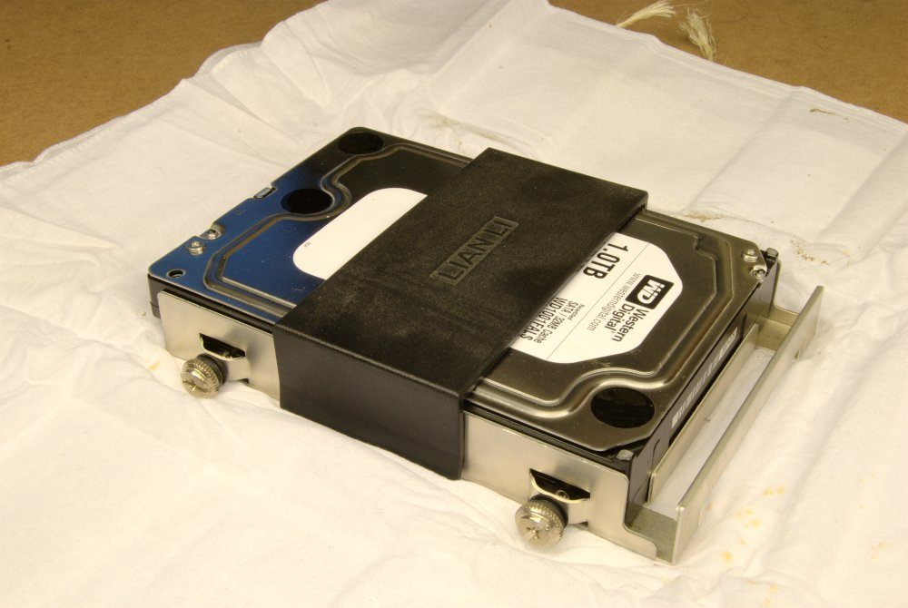
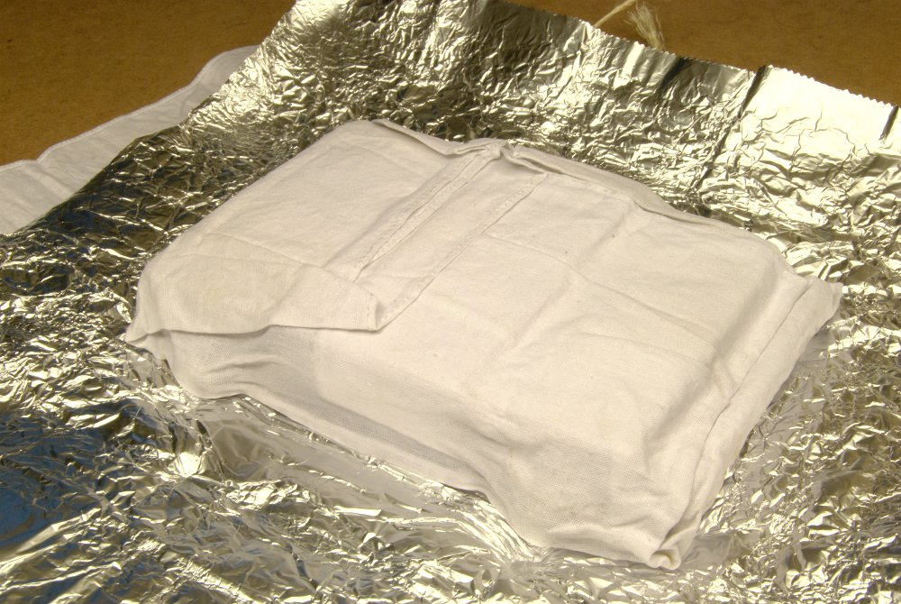
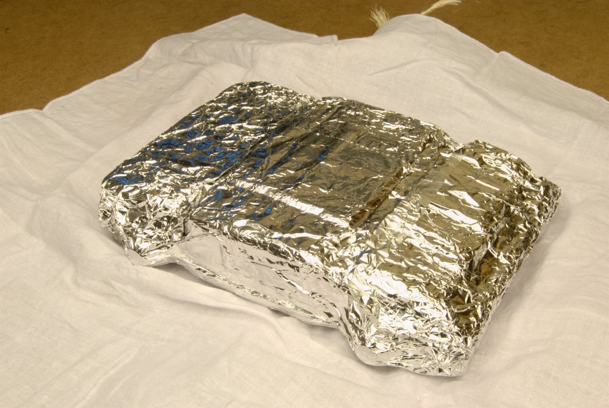
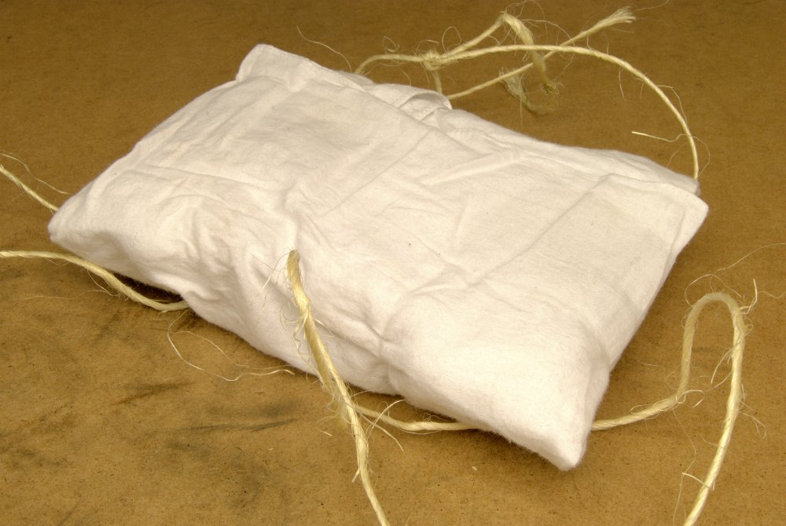
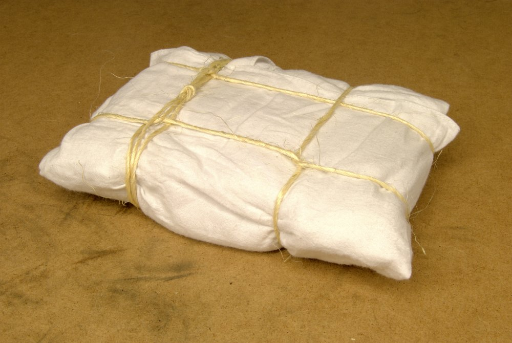



Pour faire une histoire courte, la sauvegarde du système à ma mère
était à recommencer dû à la fin de vie du disque dur de sauvegarde
précédent et je voulais effectuer le premier *snapshot*
localement.

Je n'avais pas de sac anti-statique à ma disposition et je devais
emmener mon disque dur dans ma valise. J'avais donc besoin d'une
solution facile à exécuter avec des matériaux présents dans mon
appartement et scientifiquement valide pour effectivement reproduire
les [propriétés](http://www.esdjournal.com/techpapr/ryne/esdbags.htm)
[protectrices](http://www.packagingknowledge.com/Anti_Static_Bags.asp)
des [sacs anti-statiques](http://en.wikipedia.org/wiki/Anti-static_bag) fabriqués commercialement.

Ma première hypothèse était d'utiliser un sac de lait
([polyéthylène](http://fr.wikipedia.org/wiki/Poly%C3%A9thyl%C3%A8ne)),
résistant et non-conducteur. Ceci ce serait avéré une très mauvaise
idée selon les informations que j'ai recueillies.

Il y a deux danger auxquels les pièces électroniques peuvent
être exposées&nbsp;: les décharges électrostatiques et les champs
électriques. Les modèles commerciaux sont habituellement fait de
[Poly(téréphtalate d'éthylène)](http://fr.wikipedia.org/wiki/Poly%C3%A9thyl%C3%A8ne_t%C3%A9r%C3%A9phtalate).
Des ingrédients additionnels peuvent être un filet ou
un film métallique (typiquement noir) formant une
[cage de Faraday](http://fr.wikipedia.org/wiki/Cage_de_Faraday),
ainsi que des enduits anti-statiques réduisants la propension à
accumuler une charge (rose ou vert).

Le principal indice ayant permis de trouver la solution était la
[série triboélectrique](http://en.wikipedia.org/wiki/Triboelectric#Triboelectric_series).
Cette série permet de prédire la répartition des électrons entre
deux matériaux suite à leur friction et leur séparation. Les
matériaux recherchés se trouvent au centre de la série car ils
sont le moins susceptible de causer une différence de potentiel,
et lorsque différence de potentiel il y a, celle-ci tend à être
relativement faible. Parmi les éléments du centre, on trouve le
coton, non-conducteur, et l'aluminium, un bon conducteur. Remarquez que
le polyéthylène, ma première idée, se trouve près de l'extrême
inférieur, l'éliminant de la liste des candidats potentiels.



Je vous présente donc mon design final. Du centre vers l'extérieur,
j'ai utilisé un mouchoir de coton, une feuille d'aluminium, un
autre mouchoir de coton, et de la corde de sisal pour retenir le tout
(j'imagine que le sisal se retrouve près des autres fibres naturelles
au centre-positif). Le tout était disposé entre des vêtements de
coton dans ma valise, réduisant davantage la possibilité d'effet
triboélectrique.

En conclusion, le coton jouait le double rôle de protection physique
et électrostatique. Il isolait également la pièce électronique de la
feuille d'aluminium. L'aluminium, en répartissant les charges autour
du disque dur, protégeait contre les champs électriques et dissipait
toute charge électrostatique locale. J'étais donc entièrement confiant
de pouvoir transporter mon disque dur sans l'endommager.

### Instructions

1. 
   Contenu à protéger;
1. 
   Coton;
1. 
   Feuille d'aluminium;
1. 
   Coton;
1. 
   Corde et habile usage de noeuds.
