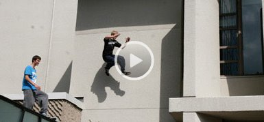

Documentaire sur le parkour animé par Stéphane Crête  
TV5  
2010-10-05 21:30

> «&nbsp;Les Traceurs utilisent la ville comme terrain de jeu et ils
> font du parkour en utilisant les éléments du mobilier urbain comme
> accessoires. Leur objectif&nbsp;: la mouvance la plus efficace
> possible!&nbsp;»

Voyez l'intégrale (lien externe):  
[ http://www.tv5.ca/webvideo/hors-serie-traceurs-2275.html](http://www.tv5.ca/webvideo/hors-serie-traceurs-2275.html)

On m'y voit parler quelques secondes, et tracer un petit peu. C'est
un très intéressant reportage sur le parkour à la grandeur du
Québec, et ça touche beaucoup d'approches et variantes.
